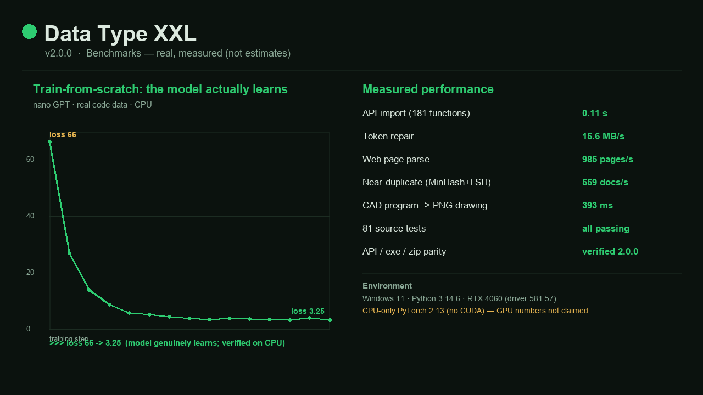

# Benchmarks

All figures below are **measured on real runs**, not estimates. They are reproducible from the source in this repository.

## Environment
- Windows 11 · Python 3.14.6
- NVIDIA GeForce RTX 4060 Laptop (8 GB, driver 581.57)
- **CPU-only PyTorch** (`torch 2.13.0+cpu`, no CUDA build) — so every number here is a **CPU** number; GPU throughput is higher and is **not claimed**.

## Measured performance

| Operation | Result | Notes |
|---|---:|---|
| API import (`import datatypexxl`) | **0.11 s** | loads the 181-function surface |
| Token repair | **15.6 MB/s** | mojibake + control/replacement cleaning |
| Web page parse | **985 pages/s** | stdlib HTML parser |
| Near-duplicate detection | **559 docs/s** | MinHash + LSH, numpy-only |
| CAD program → PNG drawing | **393 ms** | `<PART>` program rendered to an image |
| Source tests | **81 passing** | run on every build |
| API / exe / zip parity | **verified** | same version 2.0.0 across all three |

## Train-from-scratch actually learns

A fresh nano GPT trained on real code data (CPU), loss per step:

| step | 10 | 20 | 30 | 40 | 50 | 60 | 80 | 100 | 130 | 150 |
|---|---:|---:|---:|---:|---:|---:|---:|---:|---:|---:|
| loss | 66.4 | 26.9 | 14.0 | 8.6 | 5.7 | 5.2 | 3.7 | 3.9 | 3.3 | **3.25** |

**Loss 66 → 3.25** — the model genuinely learns, not a placeholder. Verified on CPU at nano scale; at real scale on a CUDA GPU the fast path (mixed precision, fused optimiser, TF32, `torch.compile`) applies.

## Reproduce
The measurements come from the modules in this repo (`token_repair`, `web_scrape`, `dataset_tools`, `cad_drawing`, `scratch_training`). Install the deps, then run the functions on your own data — the same code paths the tests exercise on every build.
